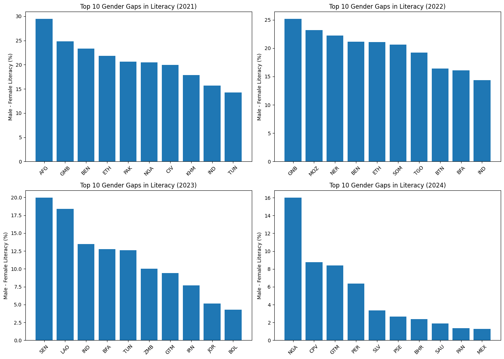
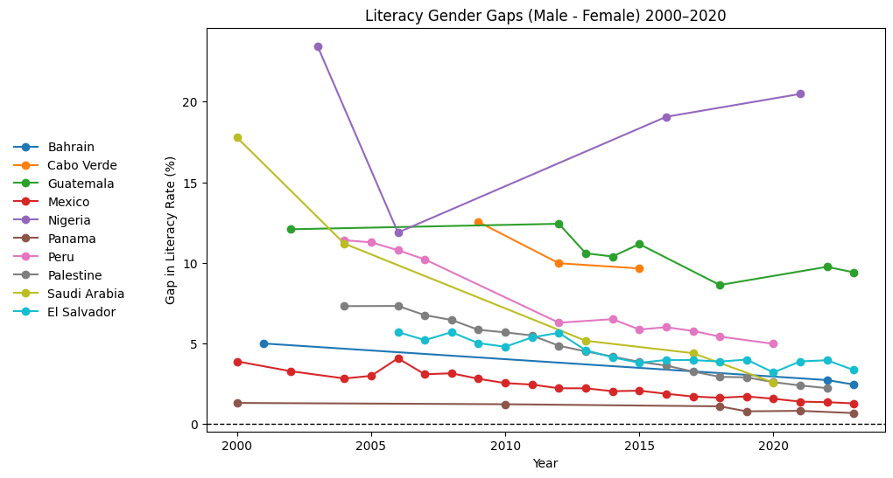

# Tutorial: Plotting Tutorial Using UNESCO Education Statistics

[Setting Up the Data](#setting-up-the-data)

[Plotting](#plotting)

[Wrapping it Up](#wrapping-it-up)

## Introduction


This tutorial will walk you through the steps of loading the UNESCO dataset, subsetting the pre-cleaned data, using Pandas to create and manipulate a DataFrame, and generating plots to visualize the data.

As entry-level data scientists and analysts, it’s easy to feel overwhelmed when working with large datasets. While the dataset used in this tutorial is already cleaned, the steps will demonstrate how to subset data and merge it with labels to create a dataset that is useful for exploring different insights.

In this tutorial, we will use UNESCO education data to examine literacy gaps between men and women aged 15 and above across the world.

## Setting Up the Data 

### The Data

The data set is sourced from the *UNESCO Institute for Statistics* website. To download the data set click on [UNESCO](https://uis.unesco.org/bdds).

After downloading the data, create a virtual environment using your preferred method and open the data folder in your IDE.

The UNESCO database includes information from national administrative records, household surveys, learning assessments, and financial statistics from over 200 countries. As of 2025, it contains more than eight million data points. While the data is already quite clean, we will still need to do some preparation before creating plots.

### Libraries

The main libraries used in this tutorial are **Pandas**, **NumPy**, and **Matplotlib**. It’s easiest to explore this dataset using Jupyter Notebooks. Start by inserting a code cell and importing the libraries.

- **Pandas** is a powerful tool for data exploration. It allows you to easily manipulate DataFrames and handle missing data.

- **NumPy**, a dependency of Pandas, will be used for numerical operations.

- **Matplotlib** is a widely used plotting library for visualizing data. We will use it to create histograms and line plots for analyzing literacy gaps.

Load the data with the following code chunk.

```python
# Load in the needed libraries.

import pandas as pd
import numpy as np
import matplotlib.pyplot as plt
```

### Loading in the Data

The zip file you downloaded from UNESCO is a folder of .csv files, let's go through what each file is. 

- **DATA_NATIONAL:** Actual literacy values by country and year.
- **COUNTRY:** Contry names and labels.
- **LABEL:** Dictionary of all the indicators. Indicators are labels that allow you to filter the data you are interested in.
- **DATA_REGIONAL:** Sames as the national file, but data is aggregated by region, not by country.

In this tutorial we will only be using **DATA_NATIONAL**, **COUNTRY**, and **LABELS**.

To load in the data use the Pandas function **pd.read_csv()** to load the .csv files into a data frame.

```python
# Load in .csv files using pd.read_csv()

eduDataSet = pd.read_csv('DATA_NATIONAL.csv')
countryLabels = pd.read_csv('COUNTRY.csv')
eduLabels = pd.read_csv('LABEL.csv')

```

**Note: You may need to specify the path to where the data is located on your machine. It will look something like the following:

```python
data = pd.read_csv('mypath/mycsvfile.csv')
```

After you have loaded in the data set, print the first five rows of each file to ensure they are properly loaded.

```python
# Print first 5 rows of eduDataSet.

eduDataSet.head()
```

It should look something like this:

| INDICATOR_ID             | COUNTRY_ID | YEAR | VALUE | MAGNITUDE | QUALIFIER |
|---------------------------|------------|------|-------|-----------|-----------|
| ADMI.ENDOFLOWERSEC.MAT    | ABW        | 2014 | 0.0   | NaN       | NaN       |
| ADMI.ENDOFLOWERSEC.MAT    | ABW        | 2015 | 0.0   | NaN       | NaN       |
| ADMI.ENDOFLOWERSEC.MAT    | ABW        | 2016 | 0.0   | NaN       | NaN       |
| ADMI.ENDOFLOWERSEC.MAT    | ABW        | 2017 | 0.0   | NaN       | NaN       |
| ADMI.ENDOFLOWERSEC.MAT    | ABW        | 2018 | 0.0   | NaN       | NaN       |


### Subsetting the Data

In order to look at the data of males and females we need to subset the data in the DATA_NATIONAL file and specify the indicators we are interested in. 

The Labels files includes all the indicators for each category. Each one is different, if you want to look at a different data simply look at the descriptions for each indicator and take note of the label.

The indicators we are interested in are the following found in the LABELS.csv:

```python
# Labels of interest.

LR.AG15T99.M,"Adult literacy rate, population 15+ years, male (%)"

LR.AG15T99.F,"Adult literacy rate, population 15+ years, female (%)"
```

We load in the data using the following code:

```python
#subset male and female data from natational set

male = eduDataSet[eduDataSet['INDICATOR_ID'] == 'LR.AG15T99.M']
female = eduDataSet[eduDataSet['INDICATOR_ID'] == 'LR.AG15T99.F']
```

After we have subset the data merge the two data frames to make a new data frame with the data of interest.

```python
#merge male and female 

LiteracyBySex = male.merge(female, on=['COUNTRY_ID', 'YEAR'], suffixes=("_male", "_female"))
```

Our new data frame will look like the following:

| COUNTRY_ID | YEAR | VALUE_male | VALUE_female | QUALIFIER_male | QUALIFIER_female |
|------------|------|------------|--------------|----------------|------------------|
| ABW        | 2000 | 97.54      | 97.07        | NaN            | NaN              |
| ABW        | 2010 | 96.94      | 96.72        | NaN            | NaN              |
| AFG        | 1979 | 30.31      | 4.99         | NaN            | NaN              |
| AFG        | 2011 | 45.42      | 17.02        | NaN            | NaN              |
| AFG        | 2015 | 50.21      | 17.09        | NaN            | UIS_EST          |

### Computing the Literacy Gap

We can now compute the gap of literacy rates (male - female) and add a new column to our data frame.

```python
# Create new column that contains male - female. 

LiteracyBySex['Gap'] = LiteracyBySex['VALUE_male'] - LiteracyBySex['VALUE_female']
```
| COUNTRY_ID | YEAR | VALUE_male | VALUE_female | QUALIFIER_male | QUALIFIER_female |    Gap    |
|------------|------|------------|--------------|----------------|------------------|-----------|
| ABW        | 2000 | 97.54      | 97.07        | NaN            | NaN              |   0.47    |
| ABW        | 2010 | 96.94      | 96.72        | NaN            | NaN              |   0.22    |
| AFG        | 1979 | 30.31      | 4.99         | NaN            | NaN              |  25.32    |
| AFG        | 2011 | 45.42      | 17.02        | NaN            | NaN              |  28.40    |
| AFG        | 2015 | 50.21      | 17.09        | UIS_EST        | UIS_EST          |  33.12    |

**Note: For the purpose of this tutorial don't worry about the NaN values, we have the columns we need to plot the data at this point.

**Optional:** We can add the full names of the countries using the following code. This will make it a bit easier to understand which countries we are looking at when plotting the data.

```python
# Add country full names.

LiteracyBySex = LiteracyBySex.merge(countryLabels, on='COUNTRY_ID', how="left")
```

## Plotting

In this section we will be focusing on how to plot the data and using it to understand the literacy gaps around the world.

### Histogram 

Using the matplotlib library we can plot data to find the top 10 countries with the greatest literacy gaps for a given year. We will plot this on a histogram graph.

Using matplotlib, we can create a 2x2 plot grid that we can plot the coutries with the largest literacy gaps for the years 2021-2024.

```python
# Define the years 2021-2024 in a list.
years = [2021, 2022, 2023, 2024]

# Create a 2x2 grid of subplots.
fig, axes = plt.subplots(2, 2, figsize=(14, 10))

# Flatten axes for easier iteration.
axes = axes.flatten()

# Loop through years and plot each histogram.
for i, year in enumerate(years):
    sample = LiteracyBySex[LiteracyBySex['YEAR'] == year].sort_values('Gap', ascending=False).head(10)

    axes[i].bar(sample['COUNTRY_ID'], sample['Gap'])
    axes[i].set_title(f"Top 10 Gender Gaps in Literacy ({year})")
    axes[i].set_ylabel("Male - Female Literacy (%)")
    axes[i].tick_params(axis='x', rotation=45)

# Adjust layout so titles and labels don’t overlap
plt.tight_layout()
plt.show()
```

The plot should look like the following:



From this graph we can see the top ten literacy gaps for each year from 2021 through 2024.

### Line Chart

To see trends over multiple years for more countries we can make a line chart using the following code.

```python
# Filter the data so that only the data between the years 2000 and 2023 is shown.

line = LiteracyBySex[(LiteracyBySex['YEAR'] >= 2000) & (LiteracyBySex['YEAR'] <= 2023)]

#Specify the countries of interest.

countries = ["NGA", "CPV", "GTM", "PER","SLV","PSE","BHR","SAU","PAN","MEX"]
line = line[line['COUNTRY_ID'].isin(countries)]


# Line chart showing data for the past 21 years.

plt.figure(figsize=(10,6))

for country in line['COUNTRY_NAME_EN'].unique():
    subset = line[line['COUNTRY_NAME_EN'] == country]
    plt.plot(subset['YEAR'], subset['Gap'], marker='o', label=country)

plt.axhline(0, color='black', linestyle='--', linewidth=1)
plt.title("Literacy Gender Gaps (Male - Female) 2000–2020")
plt.xlabel("Year")
plt.ylabel("Gap in Literacy Rate (%)")
plt.legend(
    loc='center left',
    bbox_to_anchor=(-0.3,0.5),
    frameon=False
)
plt.show()
```
The plot should look like the following:



Using this plotting method we can compare the literacy gap trends (male-female) for the past 21 years for multiple countries. If you need to add more countries you can specify that in the list in the code.

## Wrapping it Up

In this tutorial you learned how to do the following:

- Successfully load in the UNESCO education data set.
- Creat a pandas data-frame, and manipulate it to subset the data needed for plotting.
- Plot a histogram of the data.
- Plot a line chart of the data.

Download the data set from [UNESCO](https://uis.unesco.org/bdds) and follow the tutorial to get started on your own data analysis! Use the tutorial as a reference to get you started if you want to explore other data from the set.